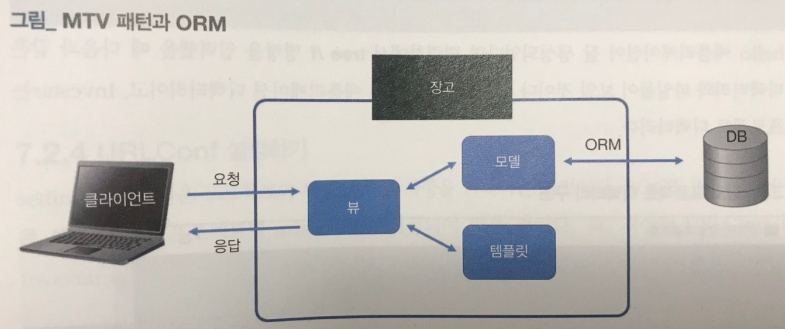
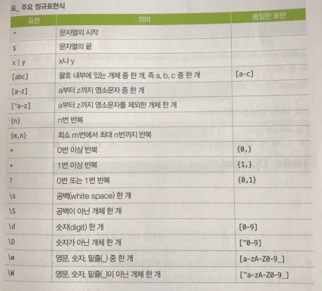
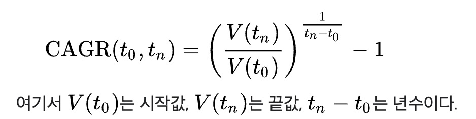
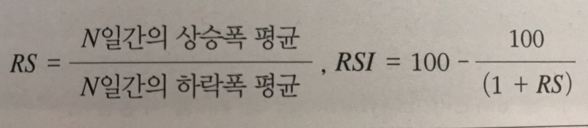

# 7장. 장고 웹 서버 구축 및 자동화
> 1) 장고 구축/구현
> 2) 슬랙 메시지 전송
> 3) 백테스트
## 7.1 장고 웹 프레임워크
### 장고
파이썬 기반 인기 웹 framework로 주로 Back-end 개발에 사용  
적은 코드로 더 빨리 더 나은 웹 애플리케이션을 만들기 위해 고안됨

### 장고 개발 배경
외국 한 신문사의 웹 프로그래머가 PHP로 만들어진 웹 사이트를 유지보수 하면서 PHP를 버리고 파이썬으로 개발하고 싶어서 직접 장고를 개발.  
=> 잘 만들어서 오픈 소스로 공개하고, 인스타그램, mozilla, pinterest에서 사용중...

### 파이썬 웹 프레임워크, 장고 VS 플라스크
장고는 대규모 웹 사이트 개발하는 프레임워크, 많은 패키지 제공.  
플라스크는 파이썬 마이크로 프레임워크를 표방하여 가볍고 간결. 직접 구현해야 하는 불편함은 있지만, 개발 자유도가 높다.

### 장고 웹 프레임워크 설치
```
pip install django
python -m django --version
3.1.1 // 현재 최신버전
mkdir mySite
django-admin startproject Investar // 장고 프로젝트 생성
python manage.py runserver 0.0.0.0:8000 // 장고 서버 실행
```

### 장고의 MTV(Model-Template-View) 패턴

MVC와 유사한 패턴  
모델 : 데이터베이스에 읽고 쓰는 역할  
템플릿 : 사용자에게 보여주는 부분 렌더링 처리  
뷰 : URL 요청에 맞게 함수를 호출하고 처리된 데이터를 템플릿에 전달

### ORM(Object Relational Mapping)
파이썬 객체와 관계형 데이터베이스를 연결
models.py 파일에 모델 클래스를 정의하면 이에 대한 매핑 테이블이 데이터베이스에 자동으로 생성되고 모델 클래스의 속성은 해당 테이블의 칼럼으로 매핑됨.

### 장고 애플리케이션 생성
```
python manage.py startapp hello
python manage.py migrate // 장고가 내부적으로 사용하는 sqlite3 데이터베이스에 변경사항 반영

Operations to perform:
  Apply all migrations: admin, auth, contenttypes, sessions
Running migrations:
  Applying contenttypes.0001_initial... OK
  ... 중간생략 ...
  Applying sessions.0001_initial... OK
```

### 정규 표현식으로 URL-View 매핑하기


### 장고 관리자 계정 생성
```
python manage.py createsuperuser
Username (leave blank to use 'user'): woonji
Email address: woonji.kim@worksmobile.com
Password: 
Password (again): 
Superuser created successfully.
```

### 장고 인덱스 페이지
Application 생성과 URL conf 추가, view 수정, 템플릿 작성 등은 실습

### 슬랙으로 알림 메시지 보내기
실습

### 백테스트
실제 적용 전, 과거 데이터를 사용해 해당 전략이 얼마나 효과적인지를 검증하는데 사용

### 백테스트 결과를 효율적으로 나타내기 위한 통계적 지표
- CAGR (Compound Annual Growth Rates, 연평균 성장률) (92pg)

- MDD (Maximum Drawdown, 최대 손실 낙폭) (153pg)  
특정 기간에 발생한 최고점에서 최저점까지의 가장 큰 손실  
(최저점 - 최고점) / 최저점
- 상관계수 (Coefficient of Correlation) (164pg)
독립변수와 종속변수 사이의 상관관계의 정도를 나타내는 수치  
-1 <= r <= 1
- 샤프지수 (Sharp Ratio) (263pg)
샤프 지수가 높을 수록 위험에 대한 보상이 크다  
(포트폴리오 예상 수익률 - 무위험률) / 수익률의 표준편차

### 백트레이더 설치
```
pip install backtrader
```
https://backtrader.com/

### 상대적 강도지수 (Relative Strength Index)

70초과 과매수, 30미만 과매도 상태

### RSI를 이용한 단순 백테스트
실습

```
pip install matplotlib==3.2.1
```
matplotlib가 3.대여야 RSI 백테스트 실행됨.